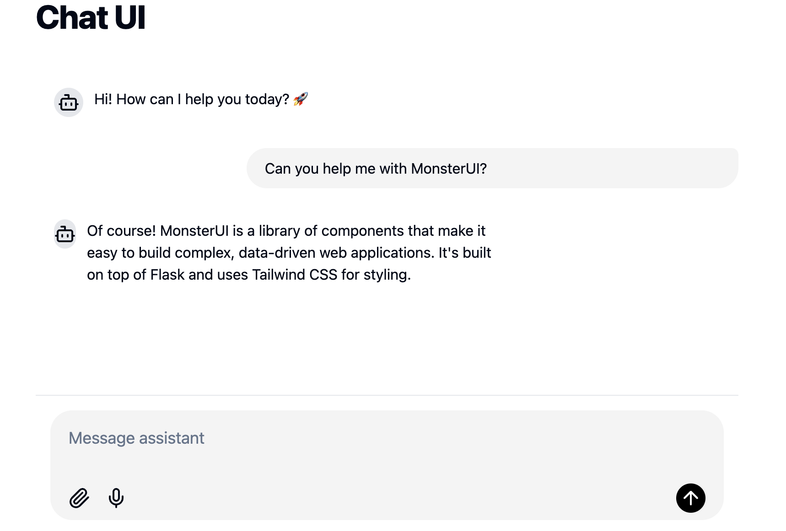

# Modern Chat UI

A modern chat interface built with FastHTML and WebSocket, featuring real-time messaging, image uploads, and voice input capabilities. Built using MonsterUI components and Claude AI for message processing.



## Features

- Real-time messaging using WebSocket
- Modern UI with MonsterUI components
- Image upload support WIP
- Voice input capability WIP
- AI-powered responses using Claude
- Mobile-responsive design

## Quick Start

1. Install dependencies:
```bash
pip install -r requirements.txt
```

2. Run the server:
```bash
python main.py
```


## Status

🚧 Work in Progress

Currently implementing:
- Audio transcription
- Image handling
- Auto-send on Enter
- Component optimization

## License

MIT