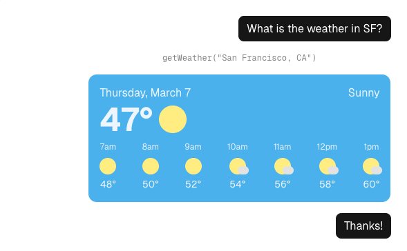
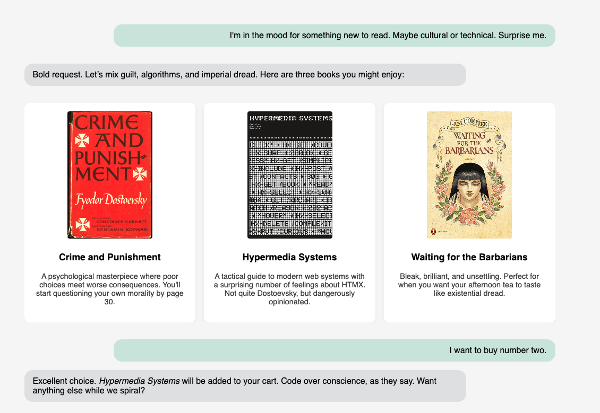
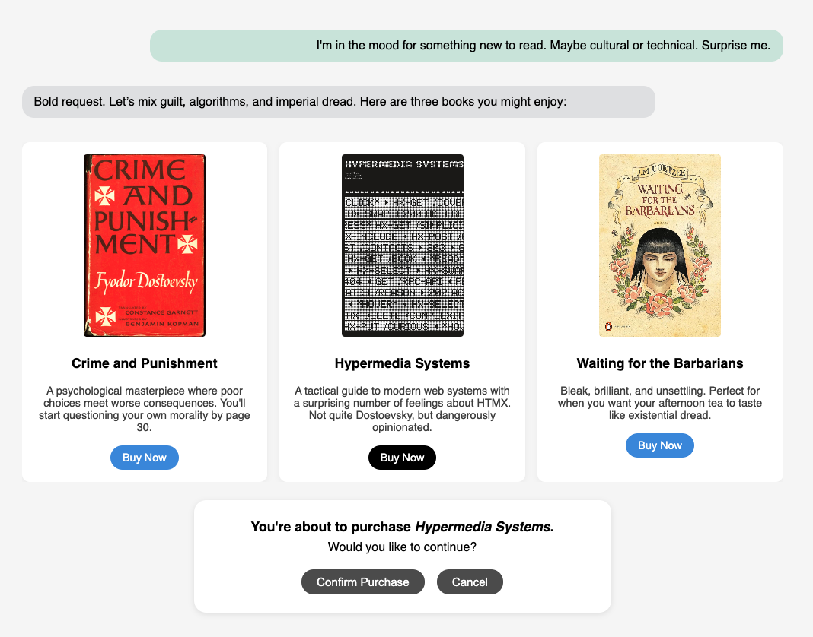
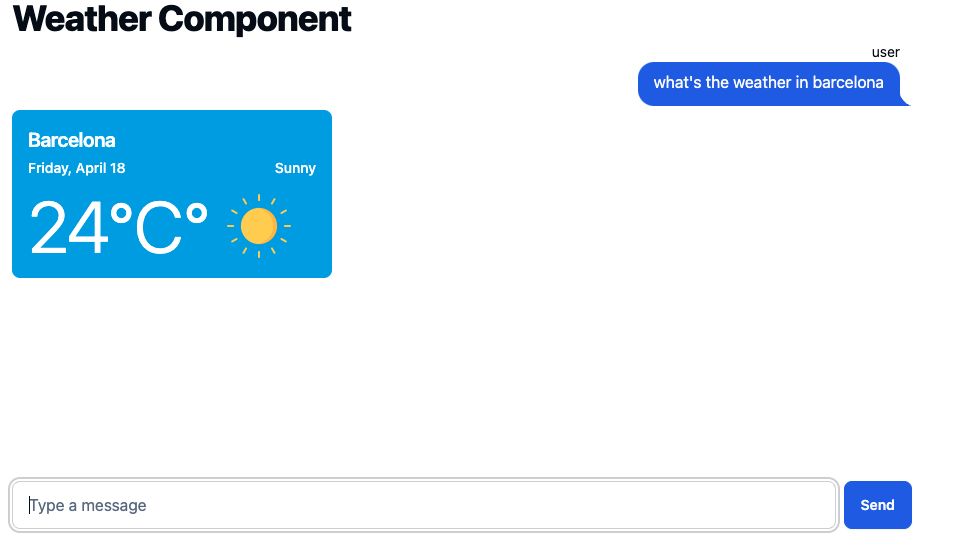
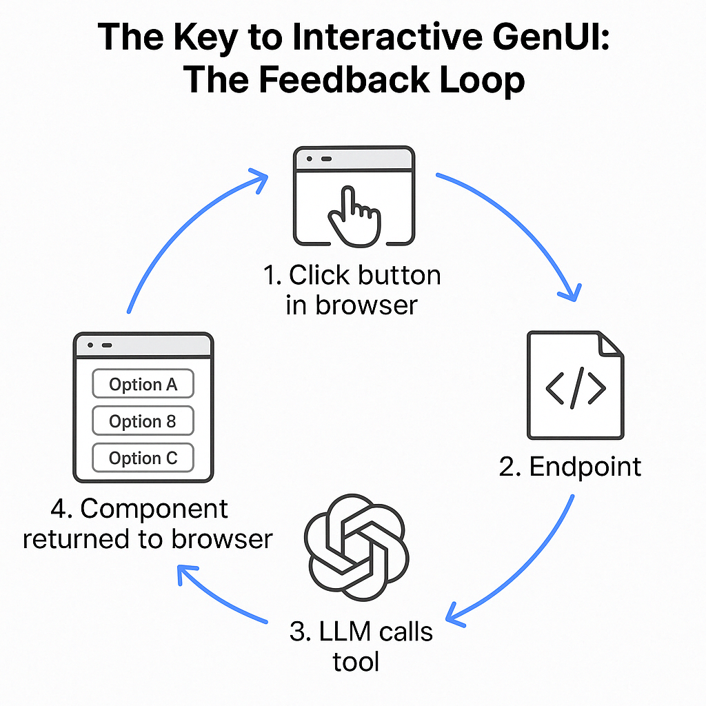
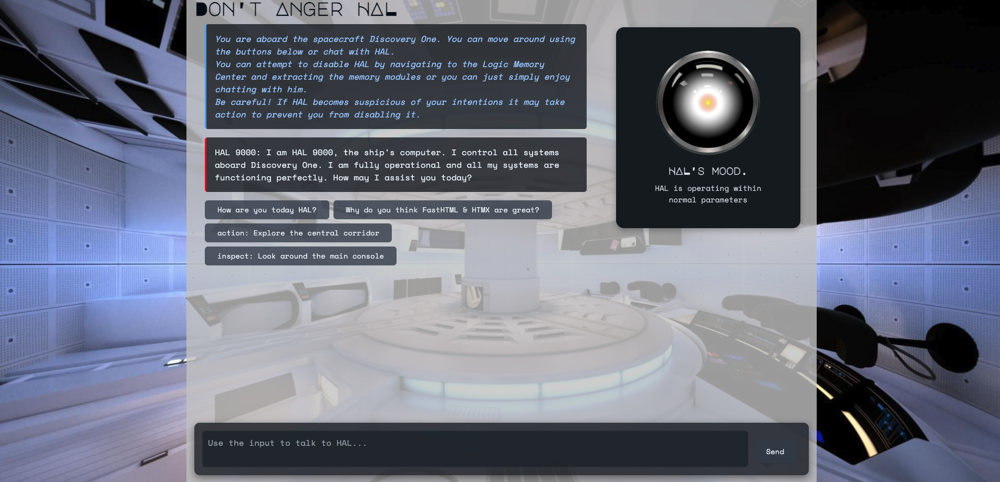

# AI is the new UI: Generative UI with FastHTML

Today's AI interfaces are predominantly text-based and feel clunky compared to traditional apps. The next generation of AI applications will need to perform much better to gain mainstream adoption. In this article, we'll explore how to transition from basic text-based chat into rich interactive experiences with buttons and visual elements - all in less than 150 lines of code using FastHTML and Answer.ai libraries. We'll see how to eliminate the "contract coupling" between frontend and backend thanks to [HTMX](https://htmx.org), enabling LLMs to generate truly dynamic interfaces that users can interact with directly.

Generative UI (genUI) extends the concept of Generative AI beyond text and images to create dynamic user interfaces. Instead of generating just text in a chat fashion, genUI produces rich components that enhance user experience. 


For example, rather than generating a text description of the weather, an LLM could return a beautiful card with visual weather information:



To make this more clear let's consider the example where we want to buy a book using ChatGPT.

Depending on how rich the interface is, we can identify three progressively better approaches:

**1. Text-Only Chat Interface**: 

In this traditional approach, you might type "I want to buy a book about AI" and receive text recommendations, requiring you to type responses for each step of the purchasing process. It would look like this:


**2. Display-Only GenUI**: 

In this improved approach, the same request produces visually appealing book cards with covers and descriptions - much nicer to look at, but you still need to type commands to make selections or purchases. ChatGPT and Claude already implement some features similar to this which allow them to generate visual elements like plots and HTML previews. These improve information presentation but these either don't allow direct interaction with the elements themselves or provide very limited ones.



**3. Interactive GenUI**: 

The next evolution allows users to directly interact with generated UI components. Like the progression from static websites to interactive web applications, this represents a fundamental shift in AI interfaces. With interactive GenUI, those same book cards now include clickable "Buy Now" buttons and other interactive elements, allowing you to complete your purchase with intuitive clicks rather than typing commands.




## Current Solution

For display-only GenUI, there are already solutions using traditional single-page application (SPA) frameworks like React or Vue. These typically work by having the LLM populate predefined component templates through tool calling or function calling.

However, these approaches face a significant challenge when attempting to build truly interactive GenUI. In traditional SPA architectures, the client and server are coupled by a data contract - the frontend expects specific JSON structures that it knows how to render. This creates what's known as "contract coupling" or "schema coupling."

The problem becomes evident when we want the LLM to generate entirely new UI patterns on the fly:

- If the LLM generates new data structures, the frontend won't know how to interpret them
- If the LLM wants to create new interaction patterns, the frontend code would need updating
- Any new UI component would require predefined client-side rendering logic

This is where FastHTML with HTMX offers a unique advantage. By leveraging a hypermedia approach, everything happens on the backend. The LLM server can generate both new content and UI components on the fly, then send complete HTML rather than just JSON data. The client simply needs to know how to process standard HTML and HTMX attributes, not specific application data structures.

This architectural approach eliminates the contract coupling problem, creating a more seamless and adaptable genUI experience where the LLM truly has control over generating interactive interfaces. 

Before going into coding we will see why is this relevant and why you should care if you are working on AI. If you just want to see the code, feel free to skip next section.

## Why is this important? AI is the new UI

The "AI is the new UI" motto highlights the idea that all traditional digital interactions will increasingly happen through an AI-mediated system. For example web search, email, booking, shopping, or anything, you name it. 

I tend to agree with this, however there is still a great gap in terms of polish between traditional UIs and new AI systems. 

Today, most user interactions with computers involve visual interfaces in web browsers or apps: clicking buttons, dragging sliders, and navigating menus. They are designed and optimized to be easy to use and visually appealing. Compared to these rich interfaces, the current AI systems feature text-based chat interfaces which feel like a downgrade - everything must be typed into a grey uninspired chat, and responses must be read. 

Despite this inferior UX, AI is so useful that people are increasingly replacing traditional UIs with LLM-based chats. Instead of searching on Google, users ask ChatGPT or Perplexity. This trend is accelerating with standards like Anthropic's Model Context Protocol (MCP), which provides a clear framework for adding tools to AI systems. Through the growing list of available tools (viewable [here](https://github.com/modelcontextprotocol/servers/tree/main)) users can now control Google Drive, GitHub, and numerous other applications directly through chat interfaces.

MCP tools are still very niche and developer oriented. As of April 18th, MCP clients exist primarily in computer-based environments like Claude's interface or IDEs such as Cursor and Windsurf, with ChatGPT and Gemini integration still pending. However, I am convinced they will very soon go mainstream. There are already emerging MCP marketplaces & extensions making the experience more accessible to non-developers.

Probably, the real bomb will drop whenever someone drops a mobile MCP client. Suddenly putting at your fingertips all these tools 24/7. It might not even be MCP, but something similar will arise for sure (maybe even [Telegram Mini Apps](https://core.telegram.org/bots/webapps). But I digress.

Whenever tools hit the mainstream developers will be faced with a significant challenge - people are not going to be happy using these tools in text interfaces. Would you prefer to have ChatGPT list your emails as plain text or use Gmail interface? 

However, if ChatGPT can generate custom Gmail-like interface that would be another deal. Even further, it could personalize this UI for you. I personally, have never managed to find a satisfying Gmail layout, category structure and categorization.

The limitations of text-based interfaces become even more glaring when money is involved. Imagine trying to shop for products when you can't even see pictures of what you're buying. 

We actually built this - our [Amazon MCP](https://github.com/Fewsats/amazon-mcp) lets you purchase anything from Amazon using any MCP Client like Claude, Cursor or Windsurf, and soon ChatGPT & Gemini. While it works technically, the experience is... well, let's just say it highlights the problem. 

As developers of [L402](https://github.com/l402-protocol/l402)(give us a star!), a protocol for machine-friendly payments in the AI ecosystem, we've seen firsthand how many engineers underestimate this UI problem. Because we developers might be perfectly happy buying kettlebells from Cursor.sh right?, but when regular people spend money, they want interfaces that feel professional, trustworthy, and yes, actually show them what they're buying. Current text-only MCP clients just don't cut it, and we're hoping the ecosystem evolves to support these GenUI capabilities soon.

In any case, as AI increasingly becomes our primary interface to computing systems, refining these interactions will be a priority for developers seeking to create seamless, intuitive experiences. Innovators & early adopters might be fine with text chats. Maybe even the early majority, the late majority and laggards will demand more.

Developers and engineers like myself tend to appreciate how revolutionary and amazing AI is, but many ordinary users are less convinced. What they often notice are clunky, outdated text-based interfaces. Most people don't really care if an app is powered by a "dumb" API or the latest frontier model. What they care about having an enjoyable and smooth experience.

I mention this as a warning, many apps have been derisively branded "just a ChatGPT wrapper" by far better engineers than me. I think this exemplifies the perfect blindness that developers can have with regard to UI/UX and all the non-engineering things that go into making a successful product.


Having said that, let's see how we can do a bit of genUI with FastHTML now.


## Basic Text Chatbot

For our first demo, we will build a basic text-based chatbot using [FastHTML](https://fastht.ml/about/). FastHTML is a Python library that combines the power of HTMX with the simplicity of FastAPI-style Python coding, making it an excellent choice for creating GenUI interfaces.

**HTMX** enhances HTML by allowing any element to become a hypermedia control that can send HTTP requests (GET, POST, PUT, etc.) and intelligently swap the responses into the DOM. This is crucial for creating interactive interfaces without complex JavaScript.

**FastHTML** wraps this functionality in a Python-first approach where HTML elements are represented as Python classes. This makes it particularly suitable for LLM-generated interfaces, as models can output Python code that directly creates UI components.

Let's examine the basic components of chatbot implementation to understand the core concepts. I've left out styling and some scaffolding code for the sake of brevity, you can see the full implementation [here](https://github.com/AnswerDotAI/fasthtml-example/blob/main/02_chatbot/basic.py).

```python
from claudette import Client

# Set up a chat model (https://claudette.answer.ai/)
cli = Client(models[-1])

# The input field for the user message. Also used to clear the
# input field after sending a message via an OOB swap
def ChatInput():
    return Input(name='msg', id='msg-input', placeholder="Type a message", hx_swap_oob='true')

# The main screen
@app.get
def index():
    page = Form(hx_post=send, hx_target="#chatlist", hx_swap="beforeend")(
           Div(id="chatlist"),
               Div()(
                   Group(ChatInput(), Button("Send"))
               )
           )
    return Titled('Chatbot Demo', page)

# Handle the form submission
@app.post
def send(msg:str, messages:list[str]=None):
    if not messages: messages = []
    messages.append(msg.rstrip())
    r = contents(cli(messages, sp=sp)) # get response from chat model
    return (ChatMessage(msg, user=True),    # The user's message
            ChatMessage(r.rstrip(), user=False), # The chatbot's response
            ChatInput()) # And clear the input field via an OOB swap
```

The most important elements here are:

1. **HTMX Attributes**: The form includes `hx_post`, `hx_target`, and `hx_swap` attributes:
   - `hx_post=send`: Makes the form submit to our `send` endpoint
   - `hx_target="#chatlist"`: Places the response in the element with id "chatlist"
   - `hx_swap="beforeend"`: Adds the response to the end of the target element

2. **OOB Swaps**: The `hx_swap_oob='true'` attribute on the returned input field tells HTMX to replace the current input field with this empty one, effectively clearing it after sending.

3. **Python-Generated HTML**: All UI elements are created through Python functions, making it easy for an LLM to generate them.

This is basic implementation is an basic text-based chatbot. Now let's see how we can enhance this to generate static UI components.


## Static GenUI :  Weather Cards

Let's take our chatbot to the next level by adding visual elements. We'll build on our previous example, transforming our plain text chatbot into something more visually engaging with minimal changes.

The heart of this enhancement is a simple component function:

```python
def WeatherComponent(location:str, temperature:str, description:str):
    """Generate a clean, minimal weather card like iPhone's weather app."""
    
    return Div(
        H2(location, cls="text-xl font-semibold mb-1"),
        # Weather content goes here
        # ...
    )
```

This function takes basic weather information and transforms it into a visually appealing card. The beauty of FastHTML is that this component is just a Python function and as such, it can be directly used as a tool by the LLM.

With our component defined, we only need to modify our message handling function:

```python
@app.post
def send(msg:str, messages:list[str]=None):
    if not messages: messages = []
    messages.append(msg.rstrip())

    cli = Client(model)
    sp="""You are a helpful assistant that invents weather for a specific location. 
                Use the tool weather_component to generate a card for the given location."""
    r = cli.structured([sp, msg], tools=[WeatherComponent])
    return (ChatMessage(msg, True),
            r[0], 
            ChatInput())
```

That's it! in our toy example the LLM will always call the `WeatherComponent` so when a user now asks "What's the weather in Paris?", all the AI will do is invent some data and pass it to the component.

The result is a visually rich card appearing directly in the chat - no additional frontend code required. 



You can find the complete weather demo code [here](https://github.com/kafkasl/genUI/tree/main/weather).

## Interactive GenUI: From Text Input to Button Clicks

In the following example, we'll see how we can make interactive components and make a complete application.

The app is created a mindful moment where the LLM guides users through a reflective experience with interactive elements. Instead of typing responses, users click on buttons as main and only interaction.


Here's how it works:
- The LLM presents the user with a set of mindfulness statements to choose from
- When the user clicks a statement, the LLM analyzes their choice
- Based on this input, the LLM generates:
  - A color representing the user's awareness state (displayed as a colored moon)
  - A poetic reflection on their current experience
  - A new set of awareness statements for the next interaction

This creates a continuous feedback loop where each choice leads to a personalized response and new options. After some interactions, the LLM offers finishing options to complete the experience.

You can find the complete mindfulness color demo code [here](https://github.com/kafkasl/genUI/tree/main/your_color).

Let's see how this interactivity is achieved. 

## The Key to Interactive GenUI: The Feedback Loop

While the full example includes many features for enhanced usability, the core mechanism that makes interactive GenUI possible with FastHTML can be distilled to a few key elements that create a perfect feedback loop:




1. The user clicks a button in the Browser which will send information to the `/send` endpoint.


2. The Endpoint will receive the data present sent by the button
```python
@app.post('/send')
async def send(data):   
    html_component = chat(data, tools=[generate_response])
    return html_component  # Return components directly to the browser
```

3. The LLM calls a tool a tool to generate the new UI components.

In our example, we pass the `generate_response` tool which can generate buttons given a list of options. 

The method would look something like this:
```python
def generate_response(options: list[str]):
    """Returns a list with a Button() for each option"""
    return [Button(option, 
                name=option, #      <- what the LLM will receive on button click
                hx_post="/send") #  <- Points back to our endpoint) 
          for option in options]
```
and the tool call would be
```python
generate_response(["Option A", "Option B", "Option C"])
```

4. The component is returned directly to the browser. No frontend code needed to interpret it - just renders the HTML which is clickable and will restart the process at step 1.

What makes this approach powerful is its simplicity. Because FastHTML components are just Python functions, they can be passed directly to the LLM as tools. The LLM generates HTML components that include HTMX attributes pointing back to the same endpoint where the LLM is listening.

When a user clicks a button, HTMX sends that interaction back to the endpoint, where the LLM can process it and generate new components in response. This creates a seamless loop where the LLM has complete control over the UI experience.


### The Power of Hypermedia Controls

What makes this approach so effective is removing the separation between frontend client and backend API. In traditional architectures, the frontend and backend communicate through data exchanges (typically JSON), requiring the frontend to be pre-programmed to interpret and render that data correctly.

This direct hypermedia exchange eliminates the contract coupling problem we discussed earlier, creating a truly adaptive and responsive GenUI experience. The AI sends complete HTML components rather than just data. The browser naturally knows how to render HTML without needing any special interpretation logic. This means:


The hypermedia approach creates a seamless loop where the AI has complete control over the UI experience without being constrained by pre-defined frontend templates or components. The browser becomes a simple rendering engine for whatever the AI wants to display, and the AI can fully understand everything sent back to its endpoint.


## The Ultimate GenUI Experience: Combining Text and Buttons

You might have noticed that our previous demo completely ditched the chat input. However, the power of this approach is that a single endpoint can handle all the interactions with any issue. To demonstrate this, in our final example, we'll combine the traditional text chat with clickable navigation in a single cohesive experience. The demo is a HAL 9000 simulator that lets users both chat conversationally with the infamous AI and navigate the Discovery One spaceship through button-based commands.



In this experience:
- Users can type messages directly to HAL in a traditional chat interface
- Users can also click action buttons to move around the spaceship or inspect objects
- HAL's "eye" changes color based on its mood, which shifts according to the conversation
- The environment updates dynamically based on user actions

The endpoint handling the new interactions is almost identical to the previous one. We just add some bits to process the user messages & actions differently (although I'm fairly sure you can make the input handling uniform), and generate more outputs in our tool. Our tool now returns HAL's color, mood & messages, the environment descriptions, and the new options.

```python
@app.post
async def send(request):
    form_data = await request.form()
    usr_choice = first(form_data.keys())  # result of clicking buttons
    usr_msg = form_data.get('user_message', '')  # result of typing in the input area
    
    # Process the user's input (whether from button or text)
    msg = usr_msg if usr_msg else usr_choice
    if msg: messages.append(msg)
    
    # Get LLM response
    r = cli.structured(messages, tools=[generate_hal_response])
    
    # The LLM's generate_hal_response tool returns a tuple with 4 elements:
    # 1. HAL's response text
    # 2. Environment description
    # 3. Color component (representing HAL's mood)
    # 4. New navigation buttons for the user
    response_text, environment_description, color_component, new_buttons = r[0]
    
    # Return updated UI components
    return (
        UserReply(msg),
        HalMessage(response_text),
        EnvironmentMessage(environment_description),
        new_buttons,
        color_component,
        InputArea())
```

To allow users to send typed messages to HAL we only need to add the following component:


```python
def InputArea():
    return Div(id="input-container", cls="input-container", hx_swap_oob="true")(
            Textarea(placeholder="Use the input to talk to HAL...", 
            name="user_message", 
            id="user-input",
            hx_post=send,
            hx_target="#chatlist",
            hx_swap="beforeend", 
            hx_trigger="keydown[key=='Enter']"),

            Button("Send", cls="hal-button send-button", hx_post=send))
```

If you have never used HTMX, you might be a bit confused about how the elements are replaced in the frontend and it's ok. It takes a bit to get used to if you've been knee deep in SPA. 

In this demo most of the heavy lifting is done by `hx_swap_oob='true'`. This attribute makes HTMX replace a webpage element by one in the respones with the same ID. In the input component above, we set this atrribute, so every time we return it it will replace the previous input and thus clear any text the user typed.

In the case of the textarea, which submits user text, we use `hx_post=send`, `hx_target=#chatlist`, and `hx_swap=beforeend` to tell HTMX to place the response of calling the method `send` inside the element with id `chatlist`, specifically `before the end`.

The HAL 9000 demo represents what we believe is the future of AI interfaces (pun intended): rich, interactive experiences that combine the best aspects of traditional GUIs with the flexibility and intelligence of large language models. By leveraging FastHTML's hypermedia approach, we've created an experience that would be significantly more complex to implement using traditional frontend frameworks, yet remains remarkably concise and maintainable.

You can explore the complete HAL 9000 demo code [here](https://github.com/kafkasl/genUI/tree/main/hal9000).

## A Note on Current Limitations

It's important to acknowledge that in the current demos, I'm using the LLM for tool calling rather than having it generate the FastHTML components directly. The LLM decides which tools to call and with what parameters, but the actual UI structure is predefined in the Python functions.

A more advanced approach would be to have the LLM generate the FastHTML components themselves as Python code. This would give the model even greater flexibility in creating novel UI patterns without predefined structures. We plan to explore this direction in a future post, as it represents the next evolution of Generative UI where the LLM has complete control over both content and presentation. 

I believe that models are getting good enough to do this with clear prompts explaining how FastHTML & HTMX work, how the single-endpoint approach can be used, and providing the language model with examples of these genUI components, such as the buttons from our demos and these kinds of interactions.

The only downside is that these libraries are less popular than other alternatives and I've seen the LLMs struggle to get right basic HTMX features like `hx-confirm` or `scroll` behaviors. At this point, it really pays off to read [Hypermedia Systems](https://hypermedia.systems/) if you are considering going down this road.

For now, our current approach strikes a practical balance between flexibility and reliability while demonstrating the core concepts of interactive GenUI.

## Bonus Track: Answer.AI

After finishing both demos I realized that the only imports I used are:

```python
from fasthtml.common import *
from monsterui.all import *
from claudette import *
from fastcore.all import *
```

When FastHTML first launched it had an ambitious goal. I tried it and liked it, but didn't use it much as I'm already familiar with other frameworks (and so do most AI assistants). However, writing this article was truly when I saw many pieces clicking together. Being able to hook Claudette to FastHTML and just let it spin into these demos was amazing to see. 

I was planning to do some very basic examples and went down the rabbit hole. Despite that, both demos are around 150 lines of code (without counting the prompts & CSS). They are 3 files: main.py, requirements.txt and a CSS file. That's it. Ready to deploy. By contrast, the basic scaffolding of a react app created with `npx create-next-app@latest` is 11 files and 5000 lines of code. Even before you begin working.

As a cherry on top, Answer.ai is now offering a deployment service [Plash](https://github.com/AnswerDotAI/plash_cli) (still in beta afaik). So once I finished the 3 demos, I just created `plash.env` and ran `plash_deploy`. Finished. The three demos are deployed. You can try the live demos here:

- [Weather Demo](https://fasthtml-app-cbd32e55.pla.sh/) 
- [Your Color Mindfulness](https://fasthtml-app-68e1764d.pla.sh/)
- [HAL 9000 Demo](https://fasthtml-app-6e583cfc.pla.sh/)

The goal of Answer.AI has always been to empower individual developers to create the AI applications of tomorrow, with a relentless focus on simplicity. These demos are the perfect embodiment of that vision - where many elements come together seamlessly without unnecessary complexity. A single developer (me in this case!) can create these beautiful, interactive experiences in just a weekend, with all the libraries from Answer.AI working in perfect synergy. That's the power of well-designed tools that prioritize developer experience without sacrificing capability. 